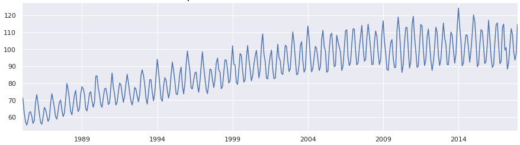

 

## Time Series Analysis
**P2024** Antoine Courbi | Thibault Gillard

# Yearly electrical production analysis

-----
### [*Moodle course*](https://moodle.epf.fr/course/view.php?id=9512)
### [*Github depository*](https://github.com/TonioElPuebloSchool/Time_Series_Analysis)
-----

This **README** explains the **architecture** of the **notebook**, the different steps and choices of the **analysis** and the **results** obtained.

# **Requirements**
The following `required packages` are needed :
```bash
seasonal_decompose
adfuller
ExponentialSmoothing
SimpleExpSmoothing
ARIMA
```

# **Overview**

As explained in the **notebook**, the original **dataset** comes from a set of three datasets from [kaggle](https://www.kaggle.com/datasets/shenba/time-series-datasets/data). The one selected is named **Electric_Production** and contains `yearly electrical production` in **IPG2211A2N**.

Here is an overview of the data :

<p align="center">
  
</p>

The dataset starts on **january 1985** and end in **january 2018**. The `test set` is chosen to be the last entire year of the dataset, from **january 107** to **december 2017**.

# **Architecture**

The project architecture is based on [this towarddatascience article](https://towardsdatascience.com/time-series-in-python-exponential-smoothing-and-arima-processes-2c67f2a52788).
This article enlight the following points :
```bash
- Decomposition of a time series
- Checking Stationarity
- Choosing a model
- Plotting predictions
```

Based on this, here is the structure of the notebook :

- Import Libraries/Data
- **Manual** Decomposition
- **TSA** Decomposition
- Check **Stationarity**
  - Convert to stationary
- **Split** the data
- **Prediction**
  - Exponential Smoothing
    - `Simple Exponential Smoothing`
    - `Triple Exponential Smoothing (HWSE)`
  - ARMA/ARIMA
    - `ARMA`
    - `ARIMA`
- Summaries

# **Results**
## Simple Exponential Smoothing

```
<class 'statsmodels.iolib.summary.Summary'>
"""
                       SimpleExpSmoothing Model Results                       
==============================================================================
Dep. Variable:             production   No. Observations:                  395
Model:             SimpleExpSmoothing   SSE                          23303.764
Optimized:                       True   AIC                           1614.606
Trend:                           None   BIC                           1622.564
Seasonal:                        None   AICC                          1614.709
Seasonal Periods:                None   Date:                 Tue, 26 Dec 2023
Box-Cox:                        False   Time:                         15:15:19
Box-Cox Coeff.:                  None                                         
==============================================================================
                       coeff                 code              optimized      
------------------------------------------------------------------------------
smoothing_level            1.0000000                alpha                 True
initial_level              72.504780                  l.0                 True
------------------------------------------------------------------------------
"""
```

## Triple Exponential Smoothing

```
<class 'statsmodels.iolib.summary.Summary'>
"""
                       ExponentialSmoothing Model Results                       
================================================================================
Dep. Variable:               production   No. Observations:                  396
Model:             ExponentialSmoothing   SSE                          23492.230
Optimized:                         True   AIC                           1630.872
Trend:                         Additive   BIC                           1658.742
Seasonal:                      Additive   AICC                          1631.339
Seasonal Periods:                     3   Date:                 Tue, 26 Dec 2023
Box-Cox:                           True   Time:                         15:16:39
Box-Cox Coeff.:                 1.14774                                         
=================================================================================
                          coeff                 code              optimized      
---------------------------------------------------------------------------------
smoothing_level               0.9944877                alpha                 True
smoothing_trend               0.0021932                 beta                 True
smoothing_seasonal            0.0054628                gamma                 True
initial_level                 101.65438                  l.0                 True
initial_trend                 0.2009154                  b.0                 True
initial_seasons.0             0.5083177                  s.0                 True
initial_seasons.1            -1.2684409                  s.1                 True
initial_seasons.2             1.0539652                  s.2                 True
---------------------------------------------------------------------------------
"""
```
## ARMA
```
<class 'statsmodels.iolib.summary.Summary'>
"""
                               SARIMAX Results                                
==============================================================================
Dep. Variable:             production   No. Observations:                  384
Model:                 ARIMA(3, 0, 4)   Log Likelihood                -994.798
Date:                Tue, 26 Dec 2023   AIC                           2007.597
Time:                        15:16:50   BIC                           2043.153
Sample:                    01-01-1985   HQIC                          2021.700
                         - 12-01-2016                                         
Covariance Type:                  opg                                         
==============================================================================
                 coef    std err          z      P>|z|      [0.025      0.975]
------------------------------------------------------------------------------
const         88.3194    171.205      0.516      0.606    -247.237     423.876
ar.L1          1.9942      0.007    299.304      0.000       1.981       2.007
ar.L2         -1.9836      0.011   -181.611      0.000      -2.005      -1.962
ar.L3          0.9892      0.006    164.874      0.000       0.977       1.001
ma.L1         -1.1876      0.050    -23.914      0.000      -1.285      -1.090
ma.L2          0.7362      0.079      9.261      0.000       0.580       0.892
ma.L3          0.0562      0.080      0.706      0.480      -0.100       0.212
ma.L4         -0.3904      0.057     -6.875      0.000      -0.502      -0.279
sigma2         9.9079      0.677     14.644      0.000       8.582      11.234
===================================================================================
Ljung-Box (L1) (Q):                   1.33   Jarque-Bera (JB):                22.40
...
===================================================================================
```
## ARIMA
```
<class 'statsmodels.iolib.summary.Summary'>
"""
                               SARIMAX Results                                
==============================================================================
Dep. Variable:             production   No. Observations:                  384
Model:                 ARIMA(3, 0, 4)   Log Likelihood                -994.798
Date:                Tue, 26 Dec 2023   AIC                           2007.597
Time:                        15:16:50   BIC                           2043.153
Sample:                    01-01-1985   HQIC                          2021.700
                         - 12-01-2016                                         
Covariance Type:                  opg                                         
==============================================================================
                 coef    std err          z      P>|z|      [0.025      0.975]
------------------------------------------------------------------------------
const         88.3194    171.205      0.516      0.606    -247.237     423.876
ar.L1          1.9942      0.007    299.304      0.000       1.981       2.007
ar.L2         -1.9836      0.011   -181.611      0.000      -2.005      -1.962
ar.L3          0.9892      0.006    164.874      0.000       0.977       1.001
ma.L1         -1.1876      0.050    -23.914      0.000      -1.285      -1.090
ma.L2          0.7362      0.079      9.261      0.000       0.580       0.892
ma.L3          0.0562      0.080      0.706      0.480      -0.100       0.212
ma.L4         -0.3904      0.057     -6.875      0.000      -0.502      -0.279
sigma2         9.9079      0.677     14.644      0.000       8.582      11.234
===================================================================================
Ljung-Box (L1) (Q):                   1.33   Jarque-Bera (JB):                22.40
...
===================================================================================
```

> ***Metric***: The `AIC` and `BIC` are measures of the goodness of fit of an estimated statistical model and can be used for **model selection**. **Lower** values for both `AIC` and `BIC` are **better**.

## Simple Exponential Smoothing

```markdown
AIC: 1614.606
BIC: 1622.564
```

The **Simple Exponential Smoothing (SES)** model is suitable for data **without** a clear **trend** or **seasonality**. The model has been optimized and the smoothing level (**alpha**) is 1. This indicates that the model puts full weight on the **most recent observation** and no weight on the older observations. 

## Triple Exponential Smoothing

```markdown
AIC: 1630.872
BIC: 1658.742
```

The **Triple Exponential Smoothing (TES)** model, also known as `Holt-Winters Exponential Smoothing`, takes into account **trend** and **seasonality**. It's more suitable for data with trends and seasonal patterns. The `AIC` and `BIC` are slightly **higher** than `SES`, indicating a slightly **worse fit**.

## ARMA

```markdown
AIC: 2007.597
BIC: 2043.153
```

The **ARMA** model is suitable for stationary time series data. It combines `autoregressive (AR)` and `moving average (MA)` models. The `AIC` and `BIC` are significantly **higher** than the previous models, indicating a **worse fit**.

## ARIMA

```markdown
AIC: 2007.597
BIC: 2043.153
```

The **ARIMA** model extends `ARMA` to **non-stationary time series** data by including differencing. The `AIC` and `BIC` are the **same** as `ARMA` in this case, indicating a **similar fit**.

---

Based on the `AIC` and `BIC`, the **Simple Exponential Smoothing model** has the **best fit**. However, since the data has a **trend** and **seasonality**, the `Triple Exponential Smoothing` model might be more appropriate despite the slightly **higher** `AIC` and `BIC`. For example if we focused on 5 years prediction instead of only 1 year, the `SES` model could perform worse (because of its focus on **last data points**). Similarly, if we want to not convert the data to *stationay*, the `ARIMA` model might be the best choice.

<p align="center">&mdash; ⭐️ &mdash;</p>
<p align="center"><i>This README was created during the Time Series Analysis course</i></p>
<p align="center"><i>Created by Antoine Courbi and Thibault Gillard</i></p>